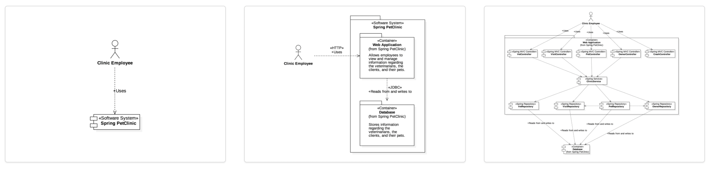

# C4 model

C4 stands for Context, Container, Component and Code. It is a new way to model modern software systems.

## Why do we need a "new" way?

For decades, UML has been the dominant way to model software systems. Though there are a few other modeling tools, UML remains the way that has the best tooling and most complete coverage in the whole software lifecycle.

C4 model is a try to simplify modeling by providing "consistent" notions and modeling languages. In UML, we use different types of diagrams at different stages. For example, use-case diagrams are used mostly for requirement collection and clarification; component diagrams are used for component design and modeling integration; deployment diagrams are used to show the deployment of software architects; sequence diagrams are used to model the interaction details at different levels. However, there is no way to "zoom in and out" from one diagram to another diagram.

## Why "zoom in and out" is important?

We as human needs context to understand a system. However, switching context introduces very high overhead in our brains. The following diagrams are from https://c4mdoel.com. It demonstrates how we can zoom in and out without switching context.

### Isn't this just UML?

The above diagrams look like just a use-case diagram, a package diagram, and a component diagram. Are those not just UML?

Well, sort of. C4 model borrows a lot of ideas and notions from UML and it looks like UML. You can say it is a subset of UML. C4 model is good-enough UML for many teams. Especially for those teams that are using ad-hoc boxes and lines, the discipline in C4 will give them immediate benefit with little overhead.

